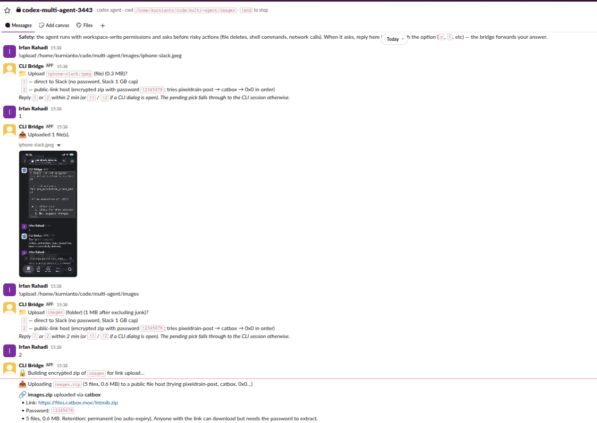

# multi-agent

> **One Slack bot, three coding agents.** Drive Claude Code, Gemini CLI,
> and Codex CLI from anywhere with Slack — no SSH, no terminal, no
> port-forwarding. Switch agents mid-conversation when one runs out of
> quota.

| Desktop Slack | iPhone Slack |
| --- | --- |
|  |  |

Same bridge, same agent, same permission dialog — answer with `1` from
the couch.

## Why this exists

If you use AI coding agents seriously, you've probably hit at least one
of these walls:

- **Codex and Gemini are terminal-only.** No remote, no mobile, no shared
  workspace. Close your laptop and the in-flight agent run goes with it.
- **Claude Code has a great mobile app — but the token quota burns
  absurdly fast.** Heavy days punch through the weekly cap by Wednesday
  and you wait for reset, watching Codex and Gemini quotas sit unused on
  the same machine.
- **No single app manages all three at once.** You juggle three terminal
  windows, three quota pages, and a "switch and re-explain context"
  workflow every time one taps out.

`multi-agent` is a small Python bridge that fixes all three. Each CLI
runs inside its own `tmux` session; the bridge screen-scrapes the TUI
and forwards input/output to a Slack channel. From any phone, browser,
or laptop with Slack you drive all three through one bot — switching
mid-thread when one hits a quota, answering permission dialogs inline,
sharing files both ways. Restart-safe (auto-relinks to live tmux on
boot), permission-gated, no idle timeout.

## At a glance

| `!help` | `!check_limit` | Tk widget |
| --- | --- | --- |
|  |  |  |

`!upload` picker — direct to Slack or encrypted zip via public-link host:



## Commands

Same grouping as `!help` in Slack. Every command works in a DM with the
bot or in a bot-invited channel.

**Start a session**

- `!gemini` / `!codex` / `!claude` — start a session right here. Best in
  a DM.
- `!gemini <name> <path>` (also `!codex` / `!claude`) — create
  `#<cli>-<name>-<uniqid>`, invite you, launch the CLI with `cwd=<path>`.
  One channel per project.

**Inside an agent channel**

- Plain text → forwarded verbatim to the CLI; the agent's reply posts
  back. No `@`-mention, no `!`.
- Permission dialogs (`Allow rm -rf? [1/2/3]`) render inline. Reply with
  the option number or `y` / `n` and the bridge forwards your answer.

**Session control**

- `!status` — what's running in this channel.
- `!reset` — kill the CLI and relaunch with the same cli/cwd/model.
- `!cancel` (aliases `!interrupt`, `!stop`) — send Esc to interrupt the
  agent mid-turn.
- `!switch <gemini|codex|claude>` — swap the CLI, keep the cwd and the
  channel. Use when one hits a quota.
- `!model <name>` — relaunch the active CLI with a model flag
  (`!model opus`, `!model gpt-5`, `!model gemini-2.5-flash`).
- `!end` — stop the session. Named channels are archived.

**Files & shell**

- `!run <cmd>` — run a shell command in the session's cwd (30s timeout).
  No tokens spent — handy for `!run git status`, `!run ls`.
- `!upload <path>` — share local file(s) or folder(s). Single-path form
  prompts:
  - `1` — direct to Slack (folder zipped, no password, junk like `.git`,
    `__pycache__`, `node_modules`, `.venv`, `*.pyc` excluded).
  - `2` — public-link host: encrypted zip with `LINK_UPLOAD_PASSWORD`,
    tries `pixeldrain-post → catbox → 0x0` in order; first one that
    works wins.

  Skip the prompt with `!upload --direct <path>` or `!upload --link
  <path>`. Multiple paths or globs always go direct.
- `!upload_monitor <path> [count=1] [interval=30]` — re-upload a single
  file `count` times with `interval` seconds between uploads. Built for
  files that get rewritten in place (screenshots, log tails) where
  `!upload` would post the snapshot once.
- `!download` (alias `!dl`) — attach a file to your Slack message *and*
  include `!download`; the bridge saves the attachment into the
  session's cwd. Useful for screenshots and PDFs.

**Visibility & recovery**

- `!sessions` (alias `!ls`, `!list`) — every active bridge session
  globally.
- `!debug` — bridge pid, uptime, in-memory sessions, and orphan tmux
  sessions matching the agent-channel pattern. Paste this when behavior
  looks off.
- `!raw [N]` (aliases `!pane`, `!tail`) — last N lines (default 60, max
  500) of the cleaned tmux pane. Use when streaming output got clipped
  to `(no output)`.
- `!check_limit` (aliases `!limits`, `!check`) — usage % for Claude /
  Gemini / Codex with reset times.
- `!kill-server` (aliases `!killserver`, `!nuke`) — `tmux kill-server`:
  wipe ALL bridge sessions and archive their channels. Clean-slate
  escape hatch.
- `!help` — the in-Slack version of this list.

## What's in this repo

- **[`slack_bridge`](./docs/slack_bridge.md)** — the bot. Slack DM/channel
  ↔ tmux ↔ CLI. Per-channel sessions, folder uploads, public-link sharing
  (encrypted zip), permission-dialog forwarding, auto-relink on restart.
- **[`check_limit`](./docs/check_limit.md)** — polls each CLI's "show my
  quota" command, parses the panel, prints a one-line summary or draws a
  Tk widget that auto-refreshes.

Per-component deep dives in [`docs/`](./docs/) ·
[overview](./docs/overview.md).

## Setup

```bash
# 1. Install deps (just slack-bolt + slack-sdk)
pip install -r requirements.txt

# 2. Copy .env.example → .env and fill in your values (see below)
cp .env.example .env
$EDITOR .env

# 3. Run the bridge (foreground for testing; scripts/run_bridge.sh for daemon)
python3 src/slack_bridge/main.py
```

You also need on your `$PATH`:
- `tmux` — used as the I/O layer for every CLI
- One or more of: `claude`, `gemini`, `codex` — the actual AI CLIs
  (installed and authenticated separately; this repo only orchestrates).
- `zip` — used to build password-protected zips for `!upload --link`.

## Required environment variables

The bridge loads `.env` at module load time. Set these in `.env` at the
repo root.

| Var | Where to get it | Required? | Used by |
| --- | --- | --- | --- |
| `SLACK_BOT_TOKEN` | Slack app → OAuth & Permissions → "Bot User OAuth Token" (`xoxb-…`) | **yes** | bridge |
| `SLACK_APP_TOKEN` | Slack app → Basic Information → App-Level Tokens (`xapp-…`, scope `connections:write`) | **yes** | bridge (Socket Mode) |
| `SLACK_USER_TOKEN` | Slack app → OAuth & Permissions → "User OAuth Token" (`xoxp-…`) | optional | `tests/slack_drive.py` only — drives the bridge as a real human via Slack |
| `LINK_UPLOAD_PASSWORD` | freeform | optional (default `changeme`) | bridge (`!upload --link` zip password) |

`.env.example` has commented placeholder lines for each. See it for full
context on the user-token scopes if you intend to run `slack_drive`.

## Required Slack app config

When creating the Slack app at https://api.slack.com/apps:

**Bot Token Scopes** (always needed):

```
app_mentions:read   chat:write           chat:write.customize
files:write         groups:history       groups:read
groups:write        im:history           im:read
im:write
```

**User Token Scopes** (only if you want `tests/slack_drive.py`):

```
chat:write            channels:history     groups:history
im:history            channels:read        groups:read
im:read               files:read           files:write
groups:write
```

**Event Subscriptions** (bot events): `app_mention`, `message.im`,
`message.groups`.

After adding scopes, click **Reinstall to Workspace** and copy the new
tokens to `.env`.

## Running

### Slack bridge (the main thing)

Long-running daemon. One process per Slack workspace.

```bash
# Foreground — for testing / first-time bring-up. Logs to stdout.
python3 src/slack_bridge/main.py

# Background — typical deployment. Survives terminal exit.
# Stops any pid recorded in slack_bridge.pid, deletes the previous
# log+pid, then relaunches under nohup with stdout+stderr redirected
# to slack_bridge.log at the repo root.
scripts/run_bridge.sh

# Tail the live log (every line is prefixed with [YYMMDD-HHMMSS]):
tail -f slack_bridge.log

# Stop the bridge:
kill "$(cat slack_bridge.pid)"
```

Re-running `scripts/run_bridge.sh` is idempotent — it kills any previous
bridge it started, wipes the old log+pid, and starts a fresh one. Use it
both for bring-up and for restart-on-config-change.

Once the bridge prints `⚡️ Bolt app is running!`, open Slack: DM the bot
or `@`-mention it in any channel and send `!help`. The full command list
lives in [Commands](#commands) above.

### Other tools (standalone, no Slack)

The bridge isn't required for these; they run on their own.

```bash
# One-shot quota summary across Claude / Gemini / Codex
python3 src/check_limit/main.py

# Tk desktop widget (auto-refresh every 6 min) — foreground
python3 src/check_limit/widget.py

# …or backgrounded the same way as the bridge.
# Writes widget.pid + widget.log at the repo root and bails early if
# $DISPLAY is unset.
scripts/run_widget.sh
```

## Tests

Three layers, increasing fidelity and cost:

```bash
# Unit tests — fast, no Slack, no real CLIs
python3 -m unittest discover tests -p 'test_*.py' -v

# In-process sim — same handler the bridge runs, against real tmux + gemini
python3 tests/sim_user.py

# End-to-end Slack drive — posts as you, walks the test plan against the
# running bridge. Auto-creates a fresh #<cli>-test_<ts> private channel
# and archives it at the end. Requires SLACK_USER_TOKEN.
python3 tests/slack_drive.py --cli gemini --skip-roundtrip
```

See [docs/slack_bridge.md → Testing](./docs/slack_bridge.md#testing) for
which Slack-side gotchas each layer catches.

## Bridge robustness

The bridge keeps session state in process memory only, so restarts
normally lose everything. Two recovery paths handle that:

- **Auto-relink (silent).** Free-text in a channel with no in-memory
  session triggers a `conversations.info` lookup; if the channel name
  matches `<cli>-<slug>-<uniqid>` and a tmux session of that name is
  alive, the bridge rebuilds the in-memory record and forwards the
  message to the running agent. No user action required.
- **Socket watchdog.** Repeated socket-state failures (`SSLEOFError`)
  trigger `os._exit(1)` so an external supervisor (`nohup` loop,
  `systemd`, `tmux respawn`) can bring up a fresh process. Auto-relink
  heals state mid-flight as users keep messaging.

`!debug` in any channel dumps the bridge's pid, uptime, in-memory
sessions, and any orphan tmux sessions matching the agent-channel
pattern. Paste its output if behavior looks wrong.

## Safety

- Codex is launched with `-s workspace-write -a untrusted` so the model
  cannot run shell commands or write files without raising a permission
  dialog that the bridge forwards to Slack.
- `!upload --link` builds a password-protected zip and posts it to a
  public file host (default order: pixeldrain → catbox → 0x0; first one
  that works wins). Anyone with the URL + password can download until
  the host expires the file (catbox is permanent, pixeldrain ~60 days,
  0x0 retention scales with size). Set `LINK_UPLOAD_PASSWORD` and
  optionally `LINK_UPLOAD_HOSTS` in `.env`.
- `!run` is *local* shell on the bridge host, executed directly as the
  bridge user. It does NOT go through any agent approval. Treat it like
  an interactive terminal session for whoever can DM the bot.
- Sessions persist until you `!end` / `!reset` / `!kill-server` — there
  is intentionally no idle timeout.

## License

(none specified yet — see [`LICENSE`](./LICENSE) if/when added.)
