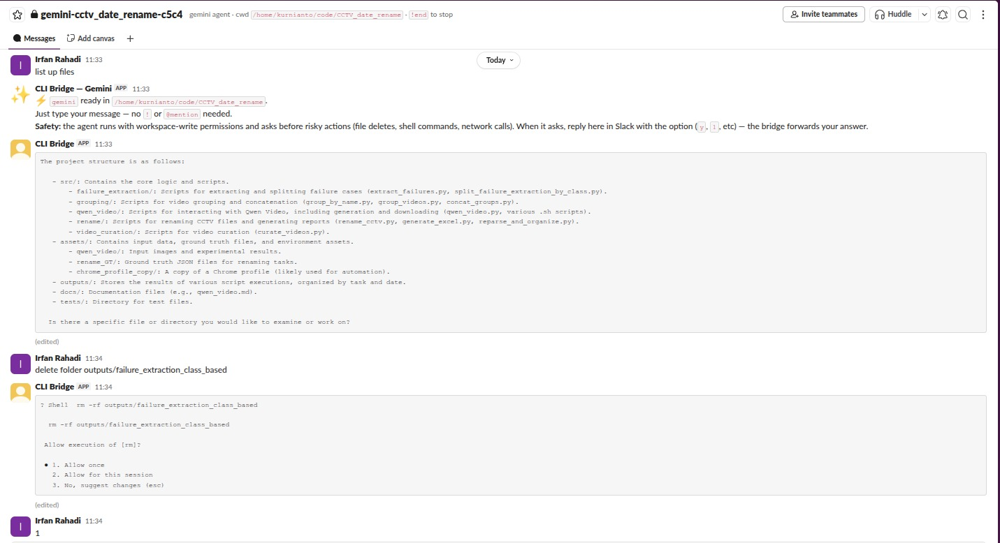
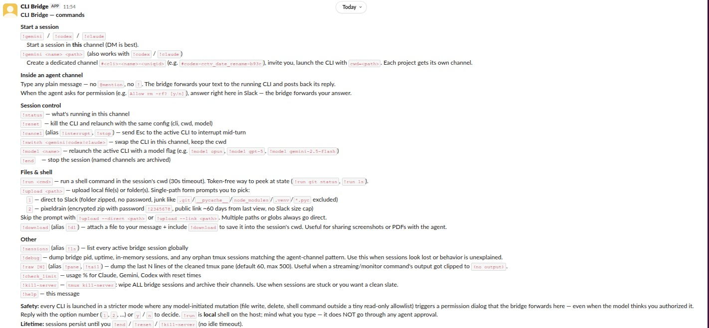
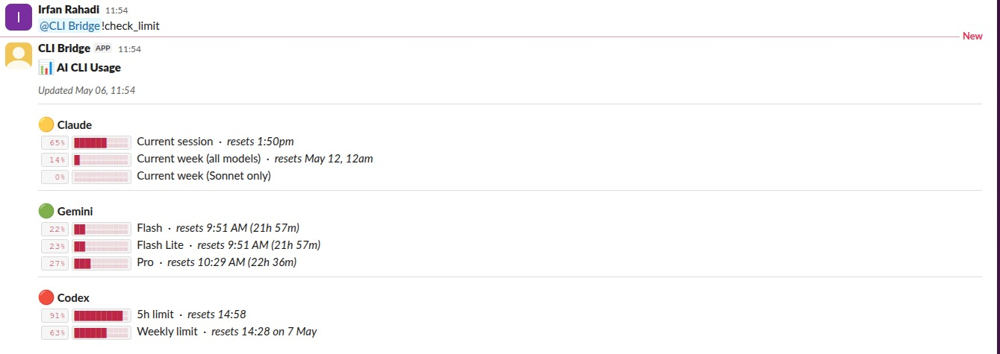
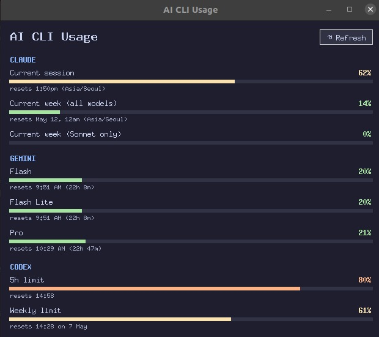

# multi-agent

> **One Slack bot, three coding agents.** Drive Claude Code, Gemini CLI,
> and Codex CLI from anywhere with Slack — no SSH, no terminal, no
> port-forwarding. Switch agents mid-conversation when one runs out of
> quota.

| Desktop Slack | iPhone Slack |
| --- | --- |
|  |  |

Same bridge, same agent, same permission dialog — answer with `1` from
the couch.

## Why this exists

If you use AI coding agents seriously, you've probably hit at least one
of these walls:

- **Codex and Gemini are terminal-only.** No remote, no mobile, no shared
  workspace. The moment you close your laptop, your in-flight agent run
  goes with it.
- **Claude Code has a great mobile app — but the token quota burns
  absurdly fast.** Heavy days punch through your weekly cap by
  Wednesday and you're stuck waiting until reset, watching Codex and
  Gemini quotas sit unused on the same machine.
- **No single app manages all three at once.** You end up juggling three
  terminal windows, three quota pages, and a "switch and re-explain
  context" workflow every time one of them taps out.

`multi-agent` is a small Python bridge that fixes all three. It runs each
CLI inside its own `tmux` session, screen-scrapes the TUI, and forwards
input/output to and from a Slack channel. From any phone, browser, or
laptop with Slack you can:

- DM the bot and chat with `!gemini` / `!codex` / `!claude`
- Spin up a per-project agent channel — `!codex myproj /path/to/repo`
  creates `#codex-myproj-xxxx`, invites you, runs codex with cwd pinned
- **Switch CLIs mid-thread when one hits a quota:** `!switch gemini` keeps
  the cwd, the channel, and your context — just swaps the brain
- See `Allow rm -rf? [1/2/3]`-style permission dialogs *inline* in Slack
  and answer them with one tap (`1`, `2`, `y`, etc.)
- Run shell commands locally without burning agent tokens (`!run git status`,
  `!run ls`)
- Upload folders as zips, share via pixeldrain link with a password,
  download files attached to your Slack message into the agent's cwd
- Watch all three quotas at a glance: `!check_limit`, or a desktop widget

Restart-safe (the bridge auto-relinks to live tmux sessions on boot),
quota-tracked, permission-gated, and no idle timeout — the agent's still
there when you come back tomorrow.

## At a glance

| `!help` in Slack | `!check_limit` in Slack | Tk widget (`widget.py`) |
| --- | --- | --- |
|  |  |  |

## What's in this repo

- **[`slack_bridge`](./docs/slack_bridge.md)** — the bot. Slack DM/channel
  ↔ tmux ↔ CLI. Per-channel sessions, folder uploads, pixeldrain links,
  permission-dialog forwarding, auto-relink on restart.
- **[`check_limit`](./docs/check_limit.md)** — polls each CLI's "show my
  quota" command, parses the panel, prints a one-line summary or draws a
  Tk widget that auto-refreshes.
- **[`multi_agent_caption`](./docs/multi_agent_caption.md)** — example of
  using both Gemini and Codex CLIs in parallel from a Python script:
  caption every video in a dataset with quota-aware fallback across
  model tiers and full resumability.

Per-component deep dives in [`docs/`](./docs/) ·
[overview](./docs/overview.md).

## Setup

```bash
# 1. Install deps (just slack-bolt + slack-sdk)
pip install -r requirements.txt

# 2. Copy .env.example → .env and fill in your values (see below)
cp .env.example .env
$EDITOR .env

# 3. Run the bridge (foreground for testing; nohup for daemon)
python3 src/slack_bridge/main.py
```

You also need on your `$PATH`:
- `tmux` — used as the I/O layer for every CLI
- One or more of: `claude`, `gemini`, `codex` — the actual AI CLIs
  (installed and authenticated separately; this repo only orchestrates).
- `zip` — used to build password-protected zips for `!upload --link`.

## Required environment variables

The bridge and the caption pipeline both load `.env` at module load time.
Set these in `.env` at the repo root.

| Var | Where to get it | Required? | Used by |
| --- | --- | --- | --- |
| `SLACK_BOT_TOKEN` | Slack app → OAuth & Permissions → "Bot User OAuth Token" (`xoxb-…`) | **yes** | bridge |
| `SLACK_APP_TOKEN` | Slack app → Basic Information → App-Level Tokens (`xapp-…`, scope `connections:write`) | **yes** | bridge (Socket Mode) |
| `SLACK_USER_TOKEN` | Slack app → OAuth & Permissions → "User OAuth Token" (`xoxp-…`) | optional | `tests/slack_drive.py` only — drives the bridge as a real human via Slack |
| `LINK_UPLOAD_PASSWORD` | freeform | optional (default `changeme`) | bridge (`!upload --link` zip password) |
| `MULTI_AGENT_CAPTION_DATASET` | path on your machine | optional (default `<repo>/datasets/videos`) | caption pipeline |

`.env.example` has commented placeholder lines for each. See it for full
context on the user-token scopes if you intend to run `slack_drive`.

## Required Slack app config

When creating the Slack app at https://api.slack.com/apps:

**Bot Token Scopes** (always needed):

```
app_mentions:read   chat:write           chat:write.customize
files:write         groups:history       groups:read
groups:write        im:history           im:read
im:write
```

**User Token Scopes** (only if you want `tests/slack_drive.py`):

```
chat:write            channels:history     groups:history
im:history            channels:read        groups:read
im:read               files:read           files:write
groups:write
```

**Event Subscriptions** (bot events): `app_mention`, `message.im`,
`message.groups`.

After adding scopes, click **Reinstall to Workspace** and copy the new
tokens to `.env`.

## Running

```bash
# Slack bridge (Socket Mode; one process per workspace)
python3 src/slack_bridge/main.py

# One-shot CLI usage summary
python3 src/check_limit/main.py

# Tk usage widget (auto-refreshes every 6 min)
python3 src/check_limit/widget.py

# Caption pipeline (long-running, resumable)
python3 src/multi_agent_caption/main.py
```

In Slack, after the bridge is running, DM your bot or `@`-mention it in a
channel to start. Send `!help` for the full command list. Useful starting
points:

- `!gemini <name> <path>` — create a private agent channel and launch
  gemini with `cwd=<path>` (also `!codex` / `!claude`)
- `!sessions` — list every active session globally
- `!debug` — dump bridge state when something looks off
- `!run <shell-cmd>` — run a shell command in the session's cwd (no agent
  involved, no tokens spent)

## Tests

Three layers, increasing fidelity and cost:

```bash
# Unit tests — fast, no Slack, no real CLIs
python3 -m unittest discover tests -p 'test_*.py' -v

# In-process sim — same handler the bridge runs, against real tmux + gemini
python3 tests/sim_user.py

# End-to-end Slack drive — posts as you, walks the test plan against the
# running bridge. Auto-creates a fresh #<cli>-test_<ts> private channel
# and archives it at the end. Requires SLACK_USER_TOKEN.
python3 tests/slack_drive.py --cli gemini --skip-roundtrip
```

See [docs/slack_bridge.md → Testing](./docs/slack_bridge.md#testing) for
which Slack-side gotchas each layer catches.

## Bridge robustness

The bridge keeps session state in process memory only, so restarts
normally lose everything. Two recovery paths handle that:

- **Auto-relink (silent).** Free-text in a channel with no in-memory
  session triggers a `conversations.info` lookup; if the channel name
  matches `<cli>-<slug>-<uniqid>` and a tmux session of that name is
  alive, the bridge rebuilds the in-memory record and forwards the
  message to the running agent. No user action required.
- **Socket watchdog.** Repeated socket-state failures (`SSLEOFError`)
  trigger `os._exit(1)` so an external supervisor (`nohup` loop,
  `systemd`, `tmux respawn`) can bring up a fresh process. Auto-relink
  heals state mid-flight as users keep messaging.

`!debug` in any channel dumps the bridge's pid, uptime, in-memory
sessions, and any orphan tmux sessions matching the agent-channel
pattern. Paste its output if behavior looks wrong.

## Safety

- Codex is launched with `-s workspace-write -a untrusted` so the model
  cannot run shell commands or write files without raising a permission
  dialog that the bridge forwards to Slack.
- `!upload --link` uploads to **pixeldrain** as a password-protected zip;
  anyone with the URL + password can download until pixeldrain expires
  the file (~60 days from last view). Set `LINK_UPLOAD_PASSWORD` in
  `.env` to your own value.
- `!run` is *local* shell on the bridge host, executed directly as the
  bridge user. It does NOT go through any agent approval. Treat it like
  an interactive terminal session for whoever can DM the bot.
- Sessions persist until you `!end` / `!reset` / `!kill-server` — there
  is intentionally no idle timeout.

## License

(none specified yet — see [`LICENSE`](./LICENSE) if/when added.)
